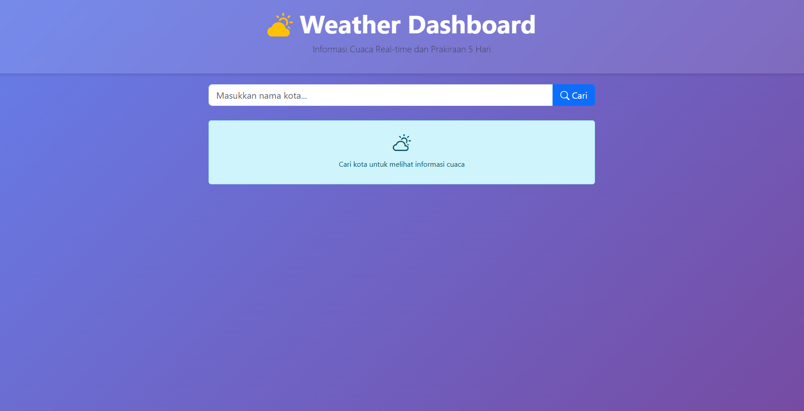
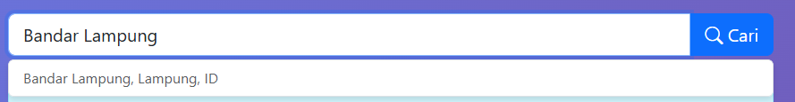
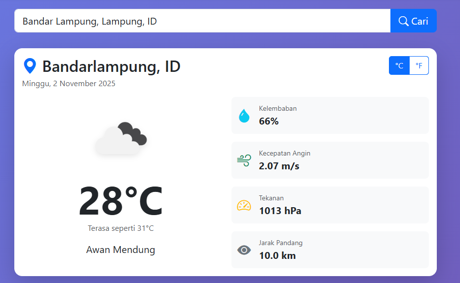
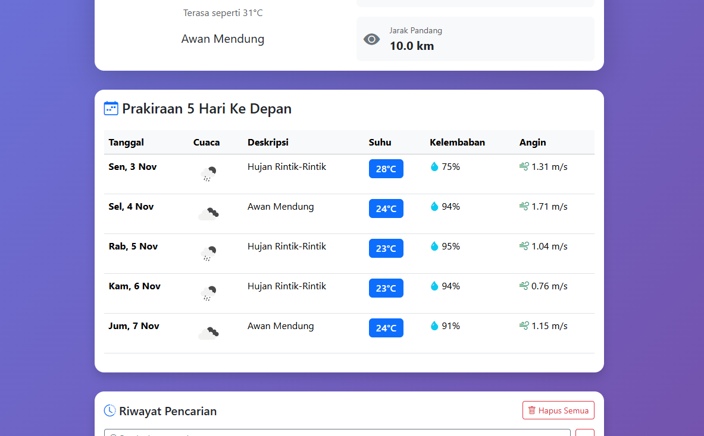
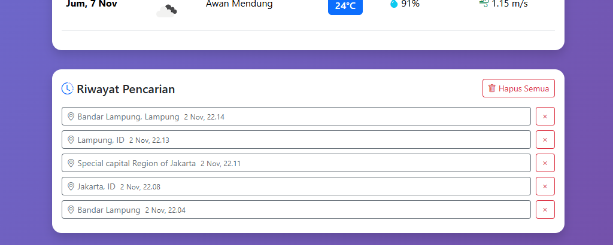

# UTS Pemrograman Web - Weather Dashboard

## Identitas
| Nama         | NIM        |
|--------------|------------|
| Michael Mathew | 123140101 |

## Deskripsi Aplikasi
Weather Dashboard ini merupakan aplikasi web yang dibangun menggunakan React dan Vite untuk menampilkan informasi cuaca dari berbagai kota di dunia. Aplikasi ini menggunakan API dari OpenWeatherMap.org untuk mendapatkan data cuaca yang akurat dan terkini.

Fitur utama aplikasi ini meliputi:
1. Pencarian Cuaca:
   - Input nama kota dengan fitur auto-suggestion
   - Mendapatkan informasi cuaca real-time
   - Interface yang user-friendly

2. Informasi Cuaca Lengkap:
   - Suhu (dengan opsi konversi °C ↔ °F)
   - Kelembapan udara
   - Kecepatan angin
   - Tekanan udara
   - Jarak pandang

3. Prakiraan Cuaca:
   - Menampilkan prakiraan cuaca untuk 5 hari ke depan
   - Informasi cuaca detail untuk setiap hari

4. Riwayat Pencarian:
   - Menyimpan history pencarian kota
   - Akses cepat ke pencarian sebelumnya

## Screenshot Aplikasi

### 1. Tampilan Dashboard Utama

Tampilan utama aplikasi yang menampilkan informasi cuaca terkini dari kota yang dicari.

### 2. Fitur Pencarian dengan Auto-suggestion

Form pencarian dengan fitur auto-suggestion yang memudahkan pengguna mencari kota.

### 3. Informasi Cuaca Detail

Menampilkan informasi lengkap termasuk:
- Suhu dengan toggle °C/°F
- Kelembapan udara
- Kecepatan angin
- Tekanan udara
- Jarak pandang

### 4. Prakiraan Cuaca 5 Hari

Menampilkan prakiraan cuaca untuk 5 hari ke depan dengan informasi detail setiap harinya.

### 5. Riwayat Pencarian

Menampilkan daftar riwayat kota yang telah dicari sebelumnya.

## Cara Instalasi dan Menjalankan Aplikasi

1. Clone repository ini
```bash
git clone https://github.com/glutt28/uts-pemweb--123140101-.git
cd uts-pemweb--123140101-/my-app
```

2. Install dependencies
```bash
npm install
```

3. Jalankan aplikasi dalam mode development
```bash
npm run dev
```

4. Buka browser dan akses aplikasi di `http://localhost:5173`

## Tech Stack
- React
- Vite
- CSS Modules
- JavaScript/JSX
- OpenWeatherMap API
- Local Storage (untuk menyimpan riwayat pencarian)

## Link Deployment
[(https://uts-pemweb-123140101.vercel.app/)](https://uts-pemweb-123140101.vercel.app/) 
